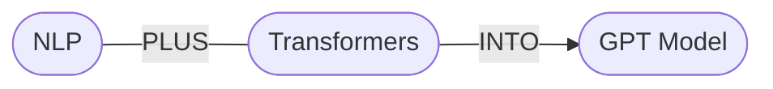

## GPT（Generative Pre-trained Transformer）
利用 NLP 的將語言計算機化，再利用多層的 Transformer 預測下個單詞機率  
模型參數數以億計  
* 簡易圖解

## Fine-Tuning
1. 前往 [OpenAI 官網](https://openai.com/product)創建帳戶
2. 右上 Personal > 左列 USER > API Keys：取得金鑰
3. [Fine-Tuning](https://platform.openai.com/docs/guides/fine-tuning)
    1. 準備訓練資料集
    2. 訓練出新的 fine-tuned model
    3. 使用此 fine-tuned model
* 實作

## 相關連結
* [Official Site：OpenAI](https://openai.com/product)
* [ChatGPT](https://chat.openai.com/chat)
* [GPT-playground](https://platform.openai.com/playground/p/default-ad-product-description?model=text-davinci-003)
* [Doc：OpenAI API](https://platform.openai.com/docs/api-reference)
